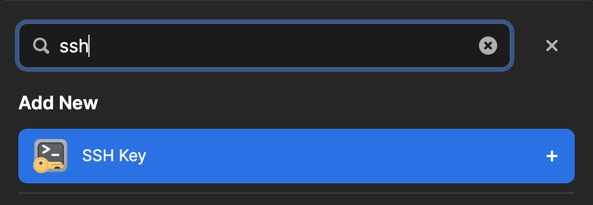

# 1Password SSH Setup

This is a helper tool to setup your SSH keys from 1Password if you have more than six private keys.
why exactly 6? keep reading...

## How to use?

1. Download the latest executeable file from the [releases](https://github.com/lacherogwu/1Password-SSH-Setup/releases/tag/v1.0)
2. Go to 1Password and download your `private_key`, the file will be save automatically to your `~/Downloads` directory
3. run the executable
4. fill the name, and the host (i.e. 212.131.20.68)

Done!

The file will be moved to `~/.ssh/{NAME}` and it will append mapping to your `~/.ssh/config` file

## Recommendations

- Set the executeable in the `/usr/local/bin` directory so you can run it straight from your terminal by typing `1p-ssh-setup`

## How to connect to your server via SSH using 1Password?

1. Add the private key to your 1Password
   
2. Add new login item with `name` and `website`

- the username will be used just as an identifier
- the website will be in the folliwing format `ssh://{USERNAME}@{HOST}`

3.  (optional) you can add a link item to your private key, just for you so you know which key it will be used behind the scenes

## Why exactly 6?

[SSH server six-key limit](https://developer.1password.com/docs/ssh/agent/advanced/#ssh-server-six-key-limit)

## Why do I need this tool?

As showed in the section above, if you have more than 6 private keys, your 7th key will not work, therefore you must setup manually the connection in `/.ssh/config`.

so the manual step will be to add some lines to your `~/.ssh/config` file, and to save the private key somewhere and to point to it in the `~/.ssh/config` file.

This tool will do all of that for you, and it will also add the mapping to your `~/.ssh/config` file.
